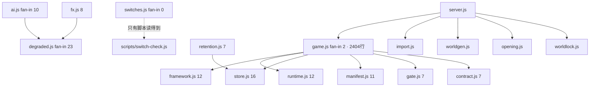
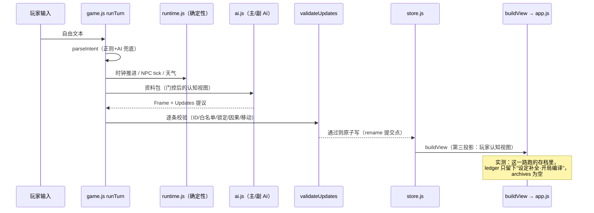

# 小猫的世界 · 设计评审（独立开发者视角）

> 评审对象：`D:\AI项目库\小猫的世界`（world-sim v2.07）
> 评审时间：2026-09-23
> 方法：读代码（src/ 36 文件 9,695 行 + server.js 1,527 + app.js 3,025）＋ 读 13 份设计文档（44.5 万字符）＋ **对 481 个真实存档做实测统计** ＋ 复原文件时间线
> 立场：个人项目，自娱自乐/学习。不套企业架构标准。
> **本文件为评审记录，不是待办清单；不含长期路线图。**

---

## 结论摘要

1. **这个项目最大的设计事实不在代码里，在存档里：481 个世界里，最深的一局是两个回合。**
   全服最深存档 `妈妈代理`（93KB）里 `experience` 记录着两句玩家输入：「脸红」「没。。没事」，然后没有第三句。
   481 个世界 **archives（剧本存档）= 0**、**visited>1 的地点移动 = 0 次**、`claims`=0、`news`=0、`messages`=0（唯一一条在测试世界）。
   → 意味着：移动/耗时、消息、新闻、日历、承诺、剧本存档、跳年、世界演化 —— **一整套核心机制从未在真实游玩里跑过一次**。
   （置信度：**高**。证据为 %APPDATA%/world-sim/data 与 world-sim/data 全量存档的机器统计。）

2. **架构赌对了，但"对"的是世界那一半。** AI 提议 / 运行时提交 / 校验器 / 知识门控 / 三投影，与 2026-06 的 PA-POMDP+PDVA 论文逐条吻合（你自己的 `审视与总结.md` §2.1 已对照）。这套东西是真资产。
   但**玩家的入口从头到尾没有被设计**：开局界面自己打印「自由输入你想做的事，例如：上前打个招呼」，这就是"没有输入契约"的自白书。

3. **17 天、114 个版本、113 个验证脚本、44.5 万字符文档、25MB 评审包** —— 而产品被使用的时间，累计不到一局开场。
   这不是"代码写得不好"的问题，是**投入结构与验证对象错位**：所有尺子量的都是代码不变量，没有一把尺子量"这局好不好玩"，所以所有关于玩法的大讨论（够不够真实、世界动不动）**在这个仓库里永远无法被证伪**。

4. **最该立刻做、成本最低、收益最大的一件事：`git init`。**
   17 天 114 个版本、零版本控制（`git log` → fatal: not a git repository）。你现在的"回退"能力等于 `.backup-v1.32` 一个手工文件夹。这不属于"过度设计"或"设计不足"，属于**基础设施缺一块**，一分钟能补。（置信度：高）

5. **真正的偏移不是"功能做偏了"，是"设计对象从玩家漂移到了世界"。**
   你自己在 `审视与总结.md` §4 列了七次决策，七次都是"拿玩家的信息或权力，换世界的自洽"。我核对后认为这个判断成立，并且**它已经在存档里留下了可量化的后果**：`knownPeople` 0～3 人（世界里 7～15 人）、`heardNews`=0、`contacts`=0、`visited`=1。
   你说的"唯一进度条：你知道得更多、被记得更多" —— **两个真实存档里，这条进度条一格都没动过。**

---

## 一、项目初衷还原（Why）

> 说明：**这个项目没有一份"我为什么要做"的文档**，这本身是第一条发现（见 §六·A1）。以下还原自三处最早的残留证据，无法证实的地方我明确标注。

### 1. 为什么开始（重构自证据链）

**证据 A**：`src/prompts.js:2` —— 「移植自 sillyCAT 插件 prompts/pipeline/*」
**证据 B**：`src/import.js` —— 全程解析酒馆角色卡（v2 JSON / PNG chara 块 / ccv3 / 文本），错误文案里教用户"请在酒馆里导出角色卡"
**证据 C**：`package.json` description —— 「AI 驱动的世界模拟 SLG（初版原型，零依赖）」
**证据 D**：`设计总稿.md` §0（创建于 2026-09-06，第一天）—— 「世界是主体，聊天只是表现形式。玩家是世界中的一个角色，不是世界中心。」

**我的还原**：你原本在酒馆（SillyTavern）里用角色卡玩，遇到的是这个领域的老问题 —— **世界是假的**：模型即兴生成一切、没有账本、会失忆、还全知（NPC 知道他不该知道的）。你想要的是**在一张卡后面放一个真的会自己运转、且玩家只能知道自己知道的世界**。所以第一天你写下了那三条硬性分界（AI 不直接写库 / 文字先翻译成结构再进代码 / UI 不持有世界真相）。

这不是猜的：这三条分界正是"陪聊"与"世界"的分界线，且第一天就写成了宪法。

### 2. 最初的核心场景与最小闭环

**证据**：`world-sim/README.md` 的"演示模式"段落 —— 内置『九十年代·青石镇』（沈姨/阿岩/大哥大时代），跑通：意图解析→时钟→NPC tick→漏斗→校验→提交→投影，含记忆衰减/已读不回/时间感知/认知地图/人物档案门控/睡眠跳跃。

**最小闭环 = 一个回合**：你打一句话 → 世界推进几分钟 → AI 写这一段 → 校验 → 提交 → 你能看到的结果。**闭环的验收对象是"世界有没有真的动"，不是"玩家有没有被给到下一步"。**

### 3. 最初的成功标准

- 文档里写过的：`世界剧设计纲领.md` §2 —— 「验收指标：玩家关掉游戏以后，**还会不会在想那件事**」；`评估与路线图.md` §3 —— 「契约合格率：首次 JSON 解析 ≥95% / 一次过校验器 ≥85% / 回退 mock ≤5%」。
- 我判断你实际在执行的标准是：**"世界能不能自己讲得通"** —— 因为它有断言、有脚本、有数字；而上面那两条感性标准**一条都没有被测量过**（见 §六·A6）。

### 4. 当时的硬约束

- 时间/精力：单人；**从 0 到 v2.07 共 17 天**（首个文件 2026-09-06 22:08，最后一版 2026-09-23）。
- 技术栈：**零依赖 Node ≥18 + 单页 HTML/JS + JSON 文件存储**（`package.json` 无运行时依赖，只有 electron 作 devDependency）。
- 预算：本地 ComfyUI（127.0.0.1:8181）+ DeepSeek API（`config.json` 里配好了真实 endpoint；`timeoutMs`=900000、`maxTokens`=393216）。
- 工具：DSH 作为编码搭子（`.dsh/skills/` 7 个技能文件）。

### 5. 当时的关键假设（哪些被证伪了）

| 假设 | 现状 | 判定 |
|---|---|---|
| "我会经常玩它" | **481 个世界，最深 2 回合** | ❌ 被证伪（最贵的那个假设） |
| "世界需要更真实才好玩" | 你自己后来引 RimWorld 作者 Tynan 的"沉浸的谬误"反驳了它 | ❌ 已被你本人推翻 |
| "文档先行能保持一致性" | 44.5 万字符文档，头部版本戳已死（见 §六·A5） | ❌ 部分证伪 |
| "AI 是主要风险，要造执法机构" | 校验器确实拦住了东西，但**玩家侧没有入口** | ⚠️ 方向对、范围错了 |
| "零依赖 + 单文件够用" | 14,250 行手写 JS，仍然能跑、能改 | ✅ 成立 |

### 6. 不可妥协 vs 可以凑合（我的判断）

- **不可妥协**（你确实没妥协）：AI 不许直接写库；名称只走 ID；时间只用 ISO；关系不数值化。
- **可以凑合**（你也确实凑合了，且凑合得对）：SQLite 一直没上、文本检索代替向量、单文件前端、JSON 全量写盘。

### 7. 需要确认（我无法从证据判定）

- **A1**：4 个 %APPDATA% 存档 + 477 个 dev 存档，是否等于你的**全部**游玩历史？（若你还从别处玩过，第 1 条结论要打折。置信度：中高）
- **A2**：「芭蕾舞班」那 475 局是导入/扫描测试产物，还是你想玩但被卡在开局？（`sceneLog`=3~5、`experience`=0，我判断是前者。置信度：高）
- **A3**：`心` 那句「没。。没事」之后你停下来的原因是什么 —— 没想法、没时间、还是不好玩？**这是本次评审最想知道的答案。**

---

## 二、初衷—现状对照

### 1. 仍在服务初衷的部分（占比不小）

| 设计 | 初衷 | 现状证据 |
|---|---|---|
| AI 提议 / 运行时提交 | 世界不能被 AI 随口改 | `validateUpdates` + 白名单 19 类 + 打回≤2 + 保守发布；`updatetypes-check.js` 守着"白名单 ⊆ 执行器" |
| 知识门控 | 玩家只知道自己知道的 | 收口成唯一执行点 `gate.nameOf()`（M6 从 7 份实现收到 1 份）+ `name-gate-check.js` 15 条 |
| 记忆衰减/激活/去重 | 人会忘、会被勾起 | `runtime.js funnelMemories`；`mem-recall.js` 有 recall@4 量表（55%→75%） |
| 载体推导（有大哥大才有短信） | 时代吻合感 | `presentation.js deriveTools`；`wx-perc-check.js` |
| 账本/原子写/单写锁 | 世界不能被写坏 | `atomic-write-check.js`(40 条) + `world-lock-check.js`(41 条) + `ledger-immutable-check.js`(48 条) —— 这是生产级思路 |
| 零依赖单机 | 自己能跑起来 | `node server.js` 即用；Electron 便携 exe 已交付 |

**这些不是我恭维你**：一个 17 天的个人项目主动去做"原子写 + 世界级单写锁 + 账本不可改写"，是超出个人项目常规的自律。

### 2. 已经偏离初衷的部分

| 偏离 | 主动 or 漂移 | 证据 | 置信度 |
|---|---|---|---|
| **产品定位从 SLG 变成"世界剧"** | ✅ 主动（`世界剧设计纲领.md` 明写"它不是 SLG，也不是 RPG"） | 但 `package.json` 至今仍写 "世界模拟 SLG" —— **定位改了，元数据没改** | 高 |
| **从"做游戏给玩家"漂到"造世界给自己看"** | ⚠️ 无意识漂移 | 七次决策全朝世界优化（你的 §3.3）；玩家侧无契约、无断言、无检查表 | 高 |
| **"真实感"被当成精度来追** | ⚠️ 漂移 | 信息旅程/时间感知/知识门控/收束 —— 四项都在减法向；你后来自己引 RimWorld 反驳 | 中高 |
| **验证资产自增殖成第二个项目** | ⚠️ 漂移 | 113 脚本 / 109 条登记 / 外发评审包 182 文件 9.6MB / 盲评包 168 文件 8MB / 13 个截图目录 12MB | 高 |
| **版本号从"发布标识"变成"进度条"** | ⚠️ 漂移 | 114 条变更记录 / 17 天 ≈ **每天 6.7 个版本**；`界面截图_v1.34…v1.51` 共 13 个截图目录 | 高 |

### 3. 过度设计（有证据）

1. **七层开关穿透注册表**：`src/switches.js`（L1 输入侧…L7 设置一致性）+ `switch-check.js` + `module-gate-check.js` 属性级检查。单人项目、开关不足 10 个。**它抓到过真 bug（开关只做入口不做出口），机制是对的，七层的规格过重。**
2. **114 个版本 × 每次"版本四处同步 + dist 部署 + 文档 §6.x 追加"**：仪式成本固定且高。证据：`catworld-dev` 技能第 2 节整整一节讲四处同步。
3. **44.5 万字符文档 / 14,250 行代码 = 31:1**。其中 `交接文档.md` 单文件 450KB、25.4 万字符。你自述"没有任何人能读完它，包括作者"。
4. **三套对外评审包装置**（外发/盲评/回执 + 源码快照重复装箱），合计 4 个 zip 25MB。
5. **20 个存档顶层容器**（M2 原文"13 个并行容器、0 条派生关系"；实测真实存档 18~19 个键），其中只有 3 个字段（sceneId/memories/relations[].tone）可重放。

### 4. 设计不足（有证据）

1. **没有版本控制**。`git log` → `fatal: not a git repository`。17 天 114 版。**这是全项目最严重的单点缺口。**
2. **玩家输入契约缺失**：开局界面的引导是一句示例文本（「例如：上前打个招呼」），不是可选项；`opLog`（你自己`审视与总结`坑4）里"你买好了车票/你差 12 块"这类**确定性结果从不进玩家视图**。
3. **世界列表无生命周期**：`/api/worlds` 直接 `(meta.worlds||[]).slice().reverse()` **全量返回、无分页、无删除、无"这是测试世界"的标记**。dev 库里躺着 477 条，其中 475 条同名「芭蕾舞班 的世界」。
4. **用量/成本无持久观测**：两个真实存档 `meta.stats` **都是 null**；`AI.statsView()` 只活在会话视图里（`game.js:1696/1832`）；`data/logs/trace.jsonl` 只有 2 行。
5. **真实模型路径未验证**：`交接文档.md` §6.114 自己写着 —— 「真模型没跑过开局编译与世界书分拣」。v2.07 的新功能，验证的是 AI 输出**之后**的机械部分。
6. **文档/技能的版本戳集体过期**（见 §六·A5）。

---

## 三、设计现状画像

### 主要模块

```
world-sim/
├─ server.js            1,527 行  HTTP + 全部 JSON API（零依赖，静态 UI 同进程）
├─ src/（36 个模块，9,695 行）—— 按职责分三层：
│   ├─ 世界真相层   store(188) runtime(643) world(178) worldgen(262) epoch(349) scheduler(271) bus(227)
│   ├─ 叙事/门控层  game(2404) ai(937) director(476) gate(283) knowledge(?) query(235)
│   │               subai storyteller(202) threads(?) phase(?) opening(196) content(106) prompts(?) 
│   └─ 基础设施层   degraded(23 处 fan-in) framework(232) manifest(?) fx(?) retention(?) visual(246)
│                   presentation(617) snapshot(176) savepack(?) repair(?) replay(?) contract(237)
│                   records(?) import(1022) worldlock(?) switches(283，fan-in=0)
└─ public/  app(3025) board(201) studio(398) + CSS 4 份（tokens 356 / style 402 / studio 357 / ux）
```

### 依赖关系（实测 require fan-in）



**读法**：`degraded.js` 被 23 个文件引用（静默降级统一计数）、`store.js` 16、`runtime.js`/`framework.js` 12 —— 中心化做得好；**但 `switches.js` fan-in = 0**，它是只为检查脚本存在的声明表。**"为检查而存在的模块"这个影子在别处还有**（见 §七·P4）。

### 关键数据流（一回合）



### 存储与技术栈

- **存储**：JSON 文件。每世界一个文件；原子写（rename 提交点）；世界级单写锁；超阈值溢出落盘（`retention.js` 策略表）。
- **两个数据根**：开发 = `world-sim/data/`；Electron = `%APPDATA%/world-sim/`（`src/store.js` resBase/resAssets）。**当前 dev 根 477 个世界 / APPDATA 根 2 个真实世界。**
- **前端**：单页、无框架、全局事件委托、`__drawnTo` 增量渲染。
- **AI**：同一个 OpenAI 兼容端点，多个角色（扫描/主/副-计算/副-编辑/摘要/演员），契约由 `src/contract.js`（237 行）声明。
- **图像**：ComfyUI（`comfyRender`）+ `src/prompts.js`（移植自 sillyCAT）+ `visual.js`/`scheduler.js`；**实测两局真实世界共生成 7 张图（gallery 7.2MB）—— 这条链路是真跑通过的。**
- **外部集成**：SillyTavern 插件 sillyCAT（两份实现并存：插件侧与引擎侧）、酒馆卡格式 v2/ccv3/PNG、酒馆 World Info。

---

## 四、设计评估（11 维）

| # | 维度 | 判断 | 理由与证据 | 置信度 |
|---|---|---|---|---|
| 1 | 与初衷对齐度 | **一般（偏差在玩家侧）** | 世界侧几乎全部对齐（校验/门控/账本/原子写）；玩家侧唯一验收指标"关掉游戏还会不会想那件事"**从未被测量**，且 481 局里最深 2 回合 | 高 |
| 2 | 模块化与边界 | **好** | 36 模块 fan-in 分布健康（degraded 23 → switches 0）；`contract.js` 单一真源；`gate.nameOf` 唯一执行点。扣分项：`switches.js` 零消费者、同一事实仍有多份（版本四处） | 高 |
| 3 | 数据一致性与数据模型 | **一般偏好** | 原子写 + 单写锁 + 账本不可改写 + 勘误事件 + 3 字段可重放对账（v1.86~v1.98）—— 超出个人项目水准。扣分项：20 个容器只有 3 个可重放；**真实存档 ledger 里没有一条游玩事件** | 高 |
| 4 | 可扩展性 | **好** | 加功能的固定动作 = 加模块 + 登记 contract + 加断言脚本，17 天里重复了 100+ 次且没崩。代价：每加一个东西，要同步的地方又多一处 | 中高 |
| 5 | 性能与瓶颈 | **好（当前规模）** | 存档 93KB、单用户、全量写盘无压力。真瓶颈是 LLM 延迟（`timeoutMs`=900000 = 15 分钟）与每回合调用数（预算 3）。隐患：`/api/worlds` 全量返回 477 条 | 中 |
| 6 | 可维护性与可测试性 | **测试一般，维护差** | 113 个脚本里没有一份"哪些还活着"的索引（技能里写的还是"43 个脚本"）；`npm test` 只覆盖 109 条登记中的 A 类；**无 git**；作者自述"读完不可能" | 高 |
| 7 | 可观测性与故障排查 | **一般偏好（内部）/ 差（跨会话）** | 内部很强：`/api/diag`、degraded 计数（棘轮）、serverLog/uiLog、三处指纹（窗口标题/buildline/JS✔）。跨会话很差：`meta.stats`=null、trace.jsonl 2 行、无 per-world 成本 | 中高 |
| 8 | 安全/权限/合规 | **够用** | 只绑 127.0.0.1、单用户、无鉴权需求；apiKey 明文在 config.json（本地可接受）。真正的风险面是**导入卡的提示词注入**，而你已经有 `jailbreak-arena.js` —— 想到了 | 中 |
| 9 | 部署/运维/灾备 | **一般** | Electron 便携 exe 是对的；存档快照（2 自动位 + 15 手动位）+ 原子写 + corrupt-check + repair.js 比多数个人项目强。扣分：**无 git**、`.backup-v1.32` 靠手工、dist 副本与源码双真源（靠 `dist-check.js` 兜） | 中高 |
| 10 | 成本效率 | **钱很省，注意力很贵** | 2 回合的 API 花费可忽略；但 17 天产出 114 版本 / 44.5 万字符 / 25MB 评审包 / 57MB `.tmp-*`。且**成本没有计量留存**（`meta.stats`=null）→ 连"贵不贵"都答不上来 | 中 |
| 11 | 认知负担 | **风险高** | 你的原话被记在文档里：「大方向偏离了一些，但我俩可能已经无法完成大方向的调节」。13 份根文档 + 7 个技能 + 113 脚本 + 477 世界 + 15 个 `.tmp-*` 目录 | 高 |

---

## 五、关键设计决策审查（6 个）

### D1 · AI 提议 / 运行时提交（PDVA）+ 校验器 —— **仍然成立，是全项目的承重墙**

- **当时的合理性**：不这么做，AI 会随口篡改世界；也是"世界真实感"的技术前提。
- **收益**：契约可测（`contract-check.js` 77 条）、白名单 ⊆ 执行器有断言、越界可拦。
- **代价**：世界的一切变化都必须表达成结构化 Update；**玩家自己的动作（"脸红"）不产生 Update** → 于是 `ledger` 在真实游玩里一条都没有。校验器只查"ID 存在 + 引用闭合"，**不查"这条该不该被批准"**（你自己在 §8.1 引 CoC-Seduce：模型失败是单向的 False Pass 9.58%）。
- **是否还成立**：成立，别动。
- **调整触发器**：当你想让"玩家的动作也在世界上留痕"时 —— 那需要给玩家动作也定义 Update 类型，而不是给校验器再加规则。

### D2 · 零依赖 Node + 单文件前端 + JSON 存档 —— **成立，但有两个副作用必须补**

- **当时合理性**：单人、Windows、要能今天就跑；`node server.js` 即用、无构建、无依赖地狱。
- **收益**：17 天能迭代 114 版，靠的就是它。
- **代价**：① `public/app.js` 3,025 行单文件；② JSON 全量写盘（现在 93KB 无所谓）；③ **没有构建步骤 ⇒ 顺手也没有版本控制**（这是心理上的关联，不是技术的必然）。
- **是否还成立**：成立。
- **触发器**：存档 > 5MB 或需要并发写时再谈分层；**但 `git init` 现在就该做，与选型无关。**

### D3 · 文档先行（`设计总稿.md` = 验收尺子）+ 技能文件 —— **过度设计，且尺子已经失效**

- **当时合理性**：你要让 AI 协作者和自己都有一把统一的尺子；对 AI 协作确实有效（技能里的红线让 agent 行为可预测）。
- **收益**：真有效 —— 不变量清单、自检三问、七层开关表都抓到了真 bug。
- **代价**：450KB 的 `交接文档.md`；**`设计总稿.md` 头部仍写"版本：v0.1（设计定稿）"而代码已 v2.07**；`交接文档.md` 头部写"版本基线 v1.10"；`.dsh/skills/catworld-dev` 写"当前版本 v1.10 / 43 个脚本"（实测 v2.07 / 113 个）—— **我这次评审第一分钟就被过期技能误导了一次。**
- **是否还成立**：部分。**"一套不变量 + 一份真相"成立；"13 份 md"不成立。**
- **调整触发器**：当你想按文档做决定、却发现要先确认文档是否过期时 —— 现在就已经到了。

### D4 · 知识门控 + 三投影 —— **理念成立，剂量已经过量**

- **当时合理性**：这是它区别于陪聊的唯一资产，且我认同它是真资产。
- **收益**：防剧透、防全知、信息差成为戏剧引擎（`name-gate-check` 15 条守着）。
- **代价（实测）**：真实存档 `knownPeople` = 0~3（世界里 7~15 个人）、`heardNews`=0、`contacts`=0、`visited`=1。
  **你说的"唯一进度条"在真实游玩里一格没动** —— 不是因为门控写错了，是因为**门控之外没有任何东西在负责"把信息送到玩家手里"**。
- **是否还成立**：成立，但需要配套的"投递契约"（谁负责让玩家知道、什么时候知道）。
- **触发器**：它就是当前最该动的那一处。

### D5 · Electron 便携 exe + %APPDATA% 数据分离 + dist 副本 —— **务实，但"两个真源"是长期税**

- **当时合理性**：你要的是"双击就能玩"，不是"能跑 node"。
- **收益**：交付形态正确（`VERSION.txt`、托盘、软渲染、`说明.txt`）。
- **代价**：源码 / `dist-app` 双份（dev 技能里 `dist-check.js` 就是为这个存在的）；`electron-bin.zip` 112MB + `dist-prep/bundle.js` 834KB + `sea-prep.blob` 68KB 都在仓库里；"80% 是旧进程/旧副本"是你自己记的坑。
- **是否还成立**：成立。
- **触发器**：当"我改了但打开还是老样子"再出现一次，就值得把"打包"变成一条命令而不是四步手工 Copy-Item。

### D6 · 无任务系统 / 收束不钩子 / 不做数值 —— **这是偏移的真正来源，需要重新拍板**

- **当时合理性**：防廉价悬念、防好感度 +1、防网文腔。三条都防对了。
- **收益**：格调高，不谄媚。
- **代价（实测）**：`claims`=0、`news`=0、`archives`=0；**开局界面要自己打印"例如：上前打个招呼"**；玩家两回合后离开。
  你在 §8.1 引的 Nature Communications 三条件实验（Free / Yoked / Passive）说得很直接：**"做了选择但系统忽略"的体验签名 ≈ "根本没有选择"。**
- **是否还成立**：**"世界不判定成败"成立；"不给玩家任何可见的动作契约"不成立** —— 这两件事被你合并成了一件。
- **触发器**：已经触发。

---

## 六、不足与风险（按严重程度排序）

### A1 · 产品从未被使用过：481 个世界，最深一局 2 回合 🔴🔴

- **位置**：`%APPDATA%/world-sim/data/worlds`（4 个文件）+ `world-sim/data/worlds`（477 个）
- **证据（机器统计，非推测）**：
  - 最深存档 `妈妈代理`：`experience` = 2 条（turn 1 "脸红"、turn 2 "没。。没事"）；`ledger` 7 条**全是同一时刻的"设定补全·开局编译"**；`archives`=0；`messages`=0；`news`=0；`claims`=0；`visited`=1。
  - 477 个 dev 世界：`experience` 回合数 **全部为 0**；sceneLog 最长 5 条。
  - 481 个世界里 **`visited>1` 出现 0 次** → **移动/耗时/交通表这一整个子系统，从未在真实游玩里跑过一次。**
- **为什么是设计问题（不是 bug）**：它说明**设计循环里缺了"使用"这一环**。所有判断（这个机制好不好、够不够真实、世不世界剧）都建立在无反馈的地基上。这不是"没时间玩"，这是**验证结构缺一层**。
- **影响**：使用（没有使用）、维护（为未验证的东西维护）、乐趣（设计者本人 2 回合离开）、学习价值（学到的是"造尺子"，不是"做游戏"）。
- **触发条件**：每一次关于玩法的争论 —— 现在正在发生。
- **应对方向**：把"一局真实游玩 ≥30 分钟且产生 archives≥1、visited≥3、news≥1"变成交付闸门之一；在这之前，**停止新增世界侧机制**。

### A2 · 无版本控制（17 天 / 114 版 / 0 commit）🔴

- **位置**：仓库根（`git log` → `fatal: not a git repository`）；现存最近似物是 `.backup-v1.32` 一个手工目录
- **为什么是设计问题**：它决定你能不能不惧地改。没有它，任何大改（比如你想要的"三处推导收口成一个函数"）都是在没有安全网的情况下动承重墙，所以你会本能地选择"再加一层"——**这正是"只加固不重构"的物理原因之一。**
- **影响**：维护（不可回退、不可 bisect、不可对照）、学习价值（失去 diff 这种最廉价的学习工具）。
- **触发条件**：一次误改 / 一次"上周那版是好的"。
- **应对方向**：`git init` + 首次提交 + `.gitignore` 排除 `dist-app/`、`electron-bin.zip`、`dist-prep/`、`data/`、`.tmp-*`、`*.zip`。（**这是全篇最便宜的一条建议。**）

### A3 · 玩家侧没有契约：世界自洽是用玩家的输入换来的 🔴

- **位置**：`public/app.js`（无"提议"渲染）、`buildView`（无 ActionSpec 等价物）；开局引导文本 `sceneLog` 第 2 条：「（这是开场。自由输入你想做的事，例如：上前打个招呼）」
- **证据**：存档里 `claims`=0；`opLog` 有 15 处确定性结果（"你买好了车票 / 你差 12 块"）却不进玩家视图（你的坑 4，我复核 `game.js:1100` 之后 opLog 命中 = 0 的说法与代码结构一致）；v1.84 删掉了 `frame.options`。
- **为什么是设计问题**：它把"世界不迁就玩家"升级成了"设计不关心玩家"（你的 §3.6 说得比我准）。
- **影响**：**这是 2 回合离开的直接原因**；也是"没有游戏性"抱怨的根源。
- **触发条件**：每一局开局的第 3 分钟。
- **应对方向**：把"本回合世界向玩家索求什么"作为回合产物之一（Concordia 的 call_to_action / ActionSpec），**只描述**不判定成败 —— 与宪法不冲突。

### A4 · 知识门控把世界调成了信息饥饿，而没有任何机制负责投递 🟠

- **位置**：`gate.nameOf`（入口侧做得很好）／缺"投递侧"
- **证据**：真实存档 `knownPeople` 0~3、`heardNews`=0、`contacts`=0；`世界剧设计纲领.md` 自述 `funnelMemories()` "现在只喂 AI，**从没给玩家用过**"（**该说法在 v2.05 后已过期** —— `game.js:1918` + `app.js:1860` 已经给玩家了，但没有任何文档记录这次转正）。
- **为什么是设计问题**：门控是减法机制，"进度条"是加法机制；**你只造了减法的执行者**。
- **影响**：玩家感知不到"知道得更多"，于是唯一的进度模型不成立。
- **触发条件**：第 1 回合就发生。
- **应对方向**：给"已知信息"一个可累计、可回看的载体（不是加面板，而是让已有记忆/印象在玩家侧有出口）。

### A5 · 同一事实存多份，且没有一份权威（尺子集体过期）🟠

- **位置与实测**：
  | 事实 | 有几份 | 现状 |
  |---|---|---|
  | 版本号 | 4 处同步 | v2.07 ✅（有 `dist-check` 守） |
  | 设计总稿版本 | 文档头部 | **写 v0.1，代码 v2.07** ❌ |
  | 交接文档版本基线 | 文档头部 | **写 v1.10** ❌ |
  | `catworld-dev` 技能的版本与脚本数 | 技能文件 | **写 v1.10 / 43 个脚本**（实测 v2.07 / 113 个）❌ |
  | `funnelMemories` 是否给玩家用过 | `世界剧设计纲领.md` | 写"从没用过"，实际已用 ❌ |
  | 提示词实现 | 插件侧 + 引擎侧 | 两份并存（`prompts.js` 自述移植自 sillyCAT）⚠️ |
  | 世界数据根 | dev / APPDATA | 两个真源，**屏幕上没有"我现在在哪个根"的标识** ⚠️ |
- **为什么是设计问题**：你的整套方法论建立在"文档是真源"上（`设计总稿` = 验收尺子）。**当尺子本身需要先验证，方法论就闭环不了。** 我这次评审就被过期技能误导过一步。
- **触发条件**：任何跨会话、跨协作者的开工。
- **应对方向**：只保留一处版本戳并由脚本守（沿用 `dist-check` 的手法）；文档头部要么自动生成，要么删掉。

### A6 · 113 个脚本没有一条能回答"这局好不好玩" 🟠

- **位置**：`scripts/`（113 个，`run-all.js` 登记 109 条 / 6 类）；`ai.js statsView()` 只进会话视图；真实存档 `meta.stats` = **null**；`data/logs/trace.jsonl` = **2 行**
- **为什么是设计问题**：仪器全部朝向"代码不变量"，**没有一件朝向"产物"**。于是"够不够真实""世界动不动"这类问题，在这个仓库里永远只能靠辩论解决 —— 而你为辩论付出的代价是再造一份 18KB 的 md。
- **影响**：设计决策质量、乐趣、学习价值（你学到的是"如何造尺子"，但你缺的是"如何量体验"）。
- **触发条件**：每次要判断玩法时。
- **应对方向**：写一个 `scripts/reality-check.js` —— 扫 `WORLD_SIM_DATA` 与 `%APPDATA%` 两份存档，打印"每个功能有没有产出过产物"（archives/messages/news/claims/visited/gallery/dayDigest 非空计数）。**这一条脚本就能把 §六·A1 的结论变成每次交付都会看到的数字。**

### A7 · 数据生命周期缺失：477 个世界、无删除、无来源标记、全量返回 🟡

- **位置**：`server.js` 的 `/api/worlds`（`(meta.worlds||[]).slice().reverse()`，无分页/无过滤）；`data/meta.json`（**91KB，477 条**）；`data/cards` 为空
- **证据**：475 个同名「芭蕾舞班 的世界」，按小时批量写入（09-20T15 一次性 78 个），全部 `experience`=0
- **为什么是设计问题**：世界是产品的核心资产，**却没有"这是测试产物"与"这是我那一局"的区分**，也没有删除/归档。个人项目的世界列表会长成垃圾场。
- **触发条件**：你想找回"妈妈代理"那一局时；或某天启动器把 dev 根与 APPDATA 根搞混时。
- **应对方向**：测试世界写到临时根（`WORLD_SIM_DATA` 已有机制，某些脚本没走）；列表加"导入产物 / 真正玩过"的区分。

### A8 · "确定性内核"含 30 处 `Math.random()` 🟡

- **位置**：`src/` 30 处 / 11 个文件（`director.js` 6、`runtime.js` 6、`worldgen.js` 5、`game.js` 3、`ai.js` 2、`store.js` 2、`subai.js` 2、`epoch/scheduler/storyteller/import` 各 1）
- **为什么是设计问题**：`不变量 §3` 写着"确定性侧 = 代码"，`ledger` 承诺可重放。**随机源不收口 ⇒ 既不可重放也不可回归**（`replay.js` 只能对账 3 个字段，根因就在这里）。
- **触发条件**：想复现一局奇怪的世界时；想回归测试"概率门/烈度"时。
- **应对方向**：单一种子源（`rng(seed)`），把 30 处换成它 —— 一次重构，换来可重放。

### A9 · 文档/评审资产已构成第二个项目 🟡

- **位置**：根 13 份 md / 44.5 万字符；`交接文档.md` 450KB / 114 条变更记录；外发评审包 182 文件 9.6MB；盲评包 168 文件 8MB；4 个 zip 25MB；13 个截图目录 12MB；15 个 `.tmp-*` 目录 776 文件 57MB；7 个 DSH 技能
- **为什么是设计问题**：它挤占的是**唯一稀缺资源：你愿意坐在那儿玩一局的时间**。
- **触发条件**：每次开工前的"先读文档"环节。

### A10 · 两个数据根的静默分裂 🟡

- **位置**：`src/store.js` resBase/resAssets；dev = `world-sim/data`，Electron = `%APPDATA%/world-sim`
- **证据**：同一份代码，两个根里躺着 477 与 2 个世界；界面上没有"当前数据根"标识（`settings` 里我不确定有没有，**标注为待确认**）
- **影响**：排查时的经典"我明明改了/我明明玩过"（你自己在 dev 技能里记的"80% 是旧进程/旧副本"）。

---

## 七、举一反三：问题模式横向排查

> 对 §六 里严重度最高的几条做抽象。核心结论：**这五条都不是孤例，各自都已经是"模式"。**

| 问题模式 | 已出现位置（实证） | 可能复现位置 | 共享触发条件 | 排查方法 | 系统性对策 |
|---|---|---|---|---|---|
| **P1 产物从未被使用**<br>（有代码、有断言、有文档，但从未产出过一件真实产物） | `archives`=0（剧本存档，README 头牌功能）· `messages`=0 · `news`=0 · `claims`=0 · 移动（`visited>1`=0 次）· 跳年（无世界越过 1 天）· 开局编译与世界书分拣（`§6.114` 自述真模型没跑过）· `dayDigest` 只 1 天 | 关系网/势力/族谱 · 战斗叙事化 · 多卡合并 · 主题包 · 副 AI-编辑 · 世界书书架 · 企划/文书 · 天气与季节 · 目击与传闻链 | **验证只走到"AI 输出之后的机械部分"**：mock 路径绿、单测绿、UI 空转 —— 全部不需要"真的玩一次" | 扫两份存档，统计每个容器/功能**非空计数**；对每个新功能问"它在哪个存档里留下过痕迹" | 写 `scripts/reality-check.js` 并把"本次交付新功能是否在真实存档留下产物"作为交付闸门；**未产出过产物的功能不许再加第二个** |
| **P2 同一事实多份，无权威** | 版本 4 处（有守）· 设计总稿头部 v0.1 · 交接文档头部 v1.10 · `catworld-dev` 技能 v1.10/43 脚本 · `funnelMemories` 给没给玩家（文档 vs 代码）· 提示词插件侧/引擎侧 · 世界书键· 世界数据两根本文 | 脚本分类表 vs `scripts/` 目录（109/113）· 不变量清单 vs 校验器实现 · `设计总稿` §14 vs `claims` 实现 · 技能 vs 代码（会持续发生） | **人写第二份的时候**（第二次描述同一件事 = 漂移起点） | 对所有"写死的常量/版本/清单"做一次 grep 找重复；对文档头部做一次逐条对账 | 沿用你已经会用、且有效的招式：**一处声明 + 断言守护**（`contract.js`/`dist-check.js`/`updatetypes-check.js` 就是这么干的）——把它推广到"版本戳"和"技能" |
| **P3 条文写了，代码没执行** | `ledger` 永不删（真实是 slide(-5000)，后改为留痕）· `ledger` 可重放（无实现，后实现 3 字段）· "确定性内核" vs 30 处 Math.random · `frame.options` 有字段无渲染（v1.84 后删）· 白名单 19 类 vs 执行器 14 个（`updatetypes-check` 现在守着） | 任何新写的提示词段落（AI 侧的君子协定：烈度/概率门/前兆链/无互动检测）· 新写的不变量条目 · 新写的 UI 红线 | **把"约定"写进提示词或文档，而不是写进代码** | 对每条不变量问三问里第三问：「AI 越线时**哪一行代码**会拦住它」——答不出来的就是 P3 | 延续你 M1 的处置原则：**要么补实现，要么把条文改成真话**（这是全仓库最好的习惯，见 §八·G6） |
| **P4 为检查而存在的影子结构** | `src/switches.js`（fan-in=0，只为 `switch-check` 活）· `scripts/run-all.js` 的分类表（第二份清单）· 122 处空 catch 时期（改成 `degraded` 统一计数后变好）· `dist-prep/bundle.js`（834KB 第二份代码）· 外发/盲评两包互为副本 | 每个新增 `*-check.js` 会带出自己的声明表 · 每次新增技能会带出一份"当前状态" · 若上 SQLite 会再出现一份 schema 真源 | **检查逻辑需要有地方声明被检查的对象** —— 声明一旦离开对象本体就成影子 | 数每个模块的 fan-in，**fan-in=0 且只有脚本 require 的，就是影子**；再 grep 一遍"同一份清单在几个地方" | 声明放进对象自身（如 `contract.js` 那样）或由对象生成；影子结构设上限（新增一个必须删一个） |
| **P5 质检资产自增殖（machinery > product）** | 113 脚本 · 109 条登记 · 44.5 万字符文档 · 25MB 评审包 · 12MB 截图 · 57MB `.tmp-*` · 7 技能（且已过期）· 114 个版本号 | `scripts/` 每次改动 +1（历史趋势：43 → 82 → 113）· 根目录 `.tmp-*` 每次任务 +1（现 15 个）· 每个新功能带一份 md | **"出问题就加一层"从不减** —— 加法没有对应的减法机制 | 给 `scripts/` 加"最后一次抓到真 bug 是哪次"的一列，长期无战功的退役；根目录按日期清 | 立一条自己的规矩：**新增一个脚本/文档时，必须合并或退役一个**；`.tmp-*` 用完即删（或统一进一个 `.work/` 并按周清） |
| **P6 版本号当进度条** | 114 条变更记录 / 17 天（6.7 版/天）· 13 个截图目录按版本命名 · 版本四处同步成为仪式 · `VERSION.txt` | 每完成一批就 +0.01 的习惯 → 会继续；以及"这版比上版更接近好玩了吗"无法回答 | **需要一个"我在前进"的可视信号**，而它恰好是最容易拿到的那个 | 把 `交接文档 §6.x` 的标题从版本号改成"玩家能感知到什么变了"；统计有多少条能通过这一问 | 换尺子：用`reality-check` 的产物计数 + "一局能玩多久"替代版本号作为进展信号 |

### 系统性排查清单（一次性跑完）

1. 存档侧：`%APPDATA%/world-sim/data/worlds/*.json` 与 `world-sim/data/worlds/*.json` —— 每个容器的非空计数、`experience` 回合数、`visited` 数、`archives` 键数。
2. 代码侧：`grep -c Math.random`、空 catch 数（应为 0，已有棘轮）、模块 fan-in（找 0）。
3. 声明侧：`contract.js` / `run-all.js` 分类表 / `switches.js` / 不变量清单 —— 四份"清单"彼此对账。
4. 文档侧：13 份 md 的头部版本戳、`.dsh/skills/*` 的"当前版本"、与代码的 `BUILD` 常量对账。
5. 入口侧：`/api/worlds` 返回条数、两个数据根在界面上的可见性。
6. 交付侧：`dist-app/.../resources/app` 与源码的 diff（`dist-check.js` 已有）。

---

## 八、举一反三：好模式复刻

> 这个项目里做得好的东西**比不足多**，而且其中有几个是可迁移的通用手法。

| 好模式 | 有效原因 | 可复刻位置 | 前置条件 | 收益 | 成本/风险 | 落地方式 |
|---|---|---|---|---|---|---|
| **G1 不变量清单 + 自检三问**<br>（`catworld-invariants`：9 条红线 + 改完三问） | 把"设计共识"压缩成**一页可判定的问句**，每次改码都能当场回答；对人和对 AI 都有效 | ① 项目根的一份 `INVARIANTS.md`；② 每次新写提示词段落时；③ 每个新模块的头部注释 | 红线要是**可判定**的（"关系不数值化"可判定；"要有氛围感"不可判定） | 决策速度、跨会话一致、AI 协作者行为可预测 | 成本≈0；风险是**清单会过期**（需与 P2 对策配套） | 照抄结构：一张表（条款 / 违反的样子 / 代码位）+ 三问收尾 |
| **G2 棘轮断言**<br>（`degrade-check.js` 只许减不许增；`ui-content-check.js` 字段→屏幕；`updatetypes-check.js` 白名单⊆执行器；`dist-check.js` 副本==源码） | 把"不许变差"这种模糊期望**变成会红灯的数字**；不需要一次修完，只需要方向单调 | ① 空 catch 数、② `Math.random` 数、③ 死容器/死字段、④ 文档字数、⑤ `.tmp-*` 目录数、⑥ 每个存档容器的"是否有产物" | 能数出来 + 有一个当前基线 | **债务只减不增**；这是让"只加固不重构"的项目仍能缓慢收敛的唯一机制 | 成本：一个脚本 + 记基线；风险：棘轮会变成"允许现状"的借口（要配一个"目标值"） | 任何你打算"以后再清"的东西，今天就写成棘轮 |
| **G3 唯一执行点收口**<br>（`gate.nameOf()` 把 7 份门控收成 1 份；`threads.js` 把三处推导折成一处；`retention.js` 策略表；`contract.js` 单一真源） | 同一个判断只允许有一个实现，**同时配一条断言证明"没有第二份"** | 30 处 `Math.random`（→ 单一种子源）· `OPLOG` 的 15 个产出点 · "悬着的事"三处推导（你自己说这是下一批最该做的）· 世界数据两根本 | 必须先有一个**断言**能证明"折叠完成"（否则会再长出来） | 一处改动全局生效；这是"加法项目"唯一可行的减法 | 成本：单次重构 + 一条断言；风险：折叠会破坏调用点的隐含差异（用断言兜） | 沿用你 M6 的三步：找全部实现 → 留一个 → 加"两侧一致"断言 |
| **G4 数据目录环境隔离**<br>（`WORLD_SIM_DATA` 临时根，测试绝不碰用户存档） | 让"跑测试"与"我的数据"物理分离，**才敢在真项目上跑自动化** | 任何有持久化状态的个人项目（下载器、笔记、爬虫） | 数据根必须能从环境变量覆盖（一条 `process.env` 分支） | 实测证明有效：**dev 根被 477 个测试世界污染，而你的 2 个真实世界完好无损** | 成本：几行代码；风险：默认值搞错会写进用户数据（已发生 —— 475 个世界就在默认根里） | 数据根 = env 优先，默认值只在打包产物里指向用户目录 |
| **G5 把红线写给 AI 协作者**<br>（`.dsh/skills/` 7 个技能：改码流程 / 不变量 / 验证手法 / UI 红线 / 生图链路…） | 把"我踩过的坑"固化成一页给 agent 的输入，**下一次会话不用重学**；实测有效（我按 `catworld-invariants` 复核代码，结论一致） | 任何与 AI 结对写的项目；尤其是"有硬约定 + 有历史事故"的项目 | 技能必须**短、可判定、带代码位**；且要有维护触发条件 | 跨会话连续性 —— 这是个人 + AI 协作最稀缺的东西 | 成本：写一次 + 维护；**风险已经发生：技能写 v1.10/43 脚本，实测 v2.07/113** | 技能里只放"不变的东西"，版本号这类易变事实**一律改成"问代码/跑脚本"** |
| **G6 对账式自我审计 + "把条文改成真话"**<br>（`设计矛盾清单.md` M1–M18，每条"要么补实现，要么把条文改成真话"） | 它把"技术债"从情绪变成**二选一的动作**；M1（ledger 永不删）没有硬造实现，而是**承认它是审计日志** | ① 每条过期文档；② 每条没有执行者的提示词约定（P3 全家）；③ 每个"以后再说" | 需要一份**带编号、带状态、带处置**的清单（你已经有了） | 这是全仓库最健康的习惯：**它防的不是 bug，是自欺** | 成本：一次盘点；风险：清单会变成许愿池（要强制二选一） | 沿用现成格式；每季度（或个人项目的"每 50 版"）跑一次 |
| **G7 崩溃安全三件套**<br>（原子写 rename 提交点 + 世界级单写锁 + 账本不可改写/勘误事件） | 这三条让"玩到一半崩了"不会变成"存档没了" | 任何写本地文件的个人项目 | 需要理解 rename 的可提交语义 | 存档可信；也让你敢做冒险的重构 | 成本：v1.98 那一批（已付）；几乎无风险 | 直接复用这三条实现思路 |

---

## 九、需要补充的信息

为了把这份评审从"读代码得出的判断"提升到"读你的意图得出的判断"，我需要：

**最关键（3 条）**

1. **一页"我为什么做这个"**，用你自己的话，不要引用文档。特别是：**你原本想玩的到底是什么局？**（一个能自己运转九十年代小镇的沙盒？一个能和卡里角色长期相处的世界？一个"看看世界会变成什么样"的观察器？三个答案会导出完全不同的下一步。）
2. **「没。。没事」之后你为什么停下。** 没想法 / 没时间 / 觉得不好玩 / 觉得它不像你想的那样 —— 哪一个？这一条比 113 个脚本加起来更有设计价值。
3. **4 个 %APPDATA% 世界是不是你的全部游玩历史？** 以及那 475 个「芭蕾舞班」是我理解的"导入测试产物"吗？

**次关键（4 条）**

4. 你现在玩 AI 角色扮演的**主要出口**还是酒馆（sillyCAT 插件）吗？world-sim 在其中的位置是"替代品"还是"世界引擎"？
5. 你愿意在一局上连续坐多久？（30 分钟 / 2 小时 / 一整天）—— 这决定"回合产出"该多密。
6. 真实模型下你有没有跑过**完整的一天**（睡觉→醒来→次日）？若有，日志在哪，我想看它在哪一步断。
7. `设计总稿.md` 头部写 v0.1、`交接文档.md` 头部写 v1.10、技能写 v1.10 —— 这是"没来得及改"还是"你心里其实一直以 v1.10 那版为准"？

**补充材料（可选）**

8. 一次真实模型完整回合的 `%TEMP%/worldsim.log` + `worldsim-ui.log`（能看到包的组装、打回、降级）。
9. 你判定"这局不错"的标准 —— 哪怕只是一句"我愿意再打一句"，也请写下来，它可以变成第一条体验断言。
10. `审视与总结.md` 里"S0+S1 已落地…v1.96"之后到 v2.07 这一段，你是按什么顺序推进的（我想知道 11 个版本里有多少是"修玩家侧"）。

**我已声明的假设（若有一条不成立，请指正，相关结论会变）**

- **H1**：我的沙箱禁止带管道 stdio 的子进程（`spawnSync node` → EPERM），**因此我无法运行 `npm test` / `run-all.js`**，无法独立验证"全绿"。§四·6 的判断基于脚本数量与结构，不基于一次成功运行。（置信度：高，这是环境限制不是项目问题）
- **H2**：以文件系统时间线为准（首文件 2026-09-06 22:08，末版 2026-09-23），项目年龄 17 天。
- **H3**：`data/meta.json`（477）与 `%APPDATA%/.../meta.json`（2）合起来是全部世界。
- **H4**：`*.json.bak-*` 是自动备份，不是独立游玩。
- **H5**：`芭蕾舞班` 系列是导入/扫描的产物。
- **H6**：文档中"已修/已落地"的自述，我只在代码里抽查，未逐条复核（抽查到的 fan-in、random、catch 数、版本戳均与自述有出入，已在文中标注）。

---

## 结尾：一句话

**你的问题是"这个世界很讲究，但没人愿意在里面待第三句话" —— 而这句话，你的存档比任何文档都更早、更准地说了出来。**
